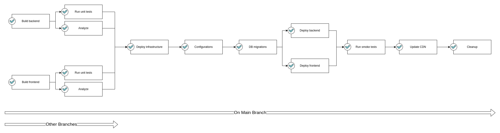
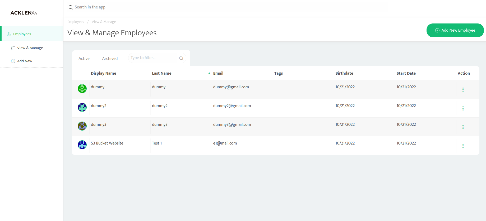

## Project #3 - Udacity Advanced Cloud DevOps Nano Degree

### Give your Application Auto-Deploy Superpowers

In this project, you will prove your mastery of the following learning objectives:

- Explain the fundamentals and benefits of CI/CD to achieve, build, and deploy automation for cloud-based software products.
- Utilize Deployment Strategies to design and build CI/CD pipelines that support Continuous Delivery processes.
- Utilize a configuration management tool to accomplish deployment to cloud-based servers.
- Surface critical server errors for diagnosis using centralized structured logging.

****

### Built With

- [Circle CI](www.circleci.com) - Cloud-based CI/CD service
- [Amazon AWS](https://aws.amazon.com/) - Cloud services
- [AWS CLI](https://aws.amazon.com/cli/) - Command-line tool for AWS
- [CloudFormation](https://aws.amazon.com/cloudformation/) - Infrastrcuture as code
- [Ansible](https://www.ansible.com/) - Configuration management tool
- [Prometheus](https://prometheus.io/) - Monitoring tool

***

### My CI/CD Pipeline

Click [here](./Screenshots/pipeline.png) to view in full resolution

> *During the execution of the pipeline, an alert is sent to Slack channel when a job fails*
> *After the pipeline is successfully executed, Prometheus monitors the deployed instances and an alert is sent to the Slack channel in case of any failure so that an action can be taken.*

****

### Submission Requirements

| Requirements                                                 | Proofs                                                       |
| :----------------------------------------------------------- | ------------------------------------------------------------ |
| Job failed because of compile errors                         | [SCREENSHOT01](./Screenshots/SCREENSHOT01.png)               |
| Job failed because of unit tests                             | [SCREENSHOT02-BACKEND](./Screenshots/SCREENSHOT02-BACKEND.png)  [SCREENSHOT02-FRONTEND](./Screenshots/SCREENSHOT02-FRONTEND.png) |
| Job that failed because of vulnerable packages               | [SCREENSHOT03-BACKEND](./Screenshots/SCREENSHOT03-BACKEND.png)  [SCREENSHOT03-FRONTEND](./Screenshots/SCREENSHOT03-FRONTEND.png) |
| An alert from one of your failed builds                      | [SCREENSHOT04](./Screenshots/SCREENSHOT04.png)               |
| Appropriate job failure for infrastructure creation          | [SCREENSHOT05](./Screenshots/SCREENSHOT05.png)               |
| Appropriate job failure for the smoke test job               | [SCREENSHOT06](./Screenshots/SCREENSHOT06.png)               |
| Successful rollback after a failed smoke test                | [SCREENSHOT07](./Screenshots/SCREENSHOT07.png)               |
| Successful promotion job                                     | [SCREENSHOT08](./Screenshots/SCREENSHOT08.png)               |
| Successful cleanup job                                       | [SCREENSHOT09](./Screenshots/SCREENSHOT09.png)               |
| Evidence that deployment is only when changes are pushed to `main` branch | [SCREENSHOT10](./Screenshots/SCREENSHOT10.png)               |
| An alert that was sent by Prometheus                         | [SCREENSHOT12](./Screenshots/SCREENSHOT12.png)               |
| Accessing frontend from public S3 Bucket (aka, your green candidate front-end) | [SCREENSHOT-S3](./Screenshots/URL03_SCREENSHOT_S3.png)       |
| Accessing frontend from public CloudFront distribution (aka, your blue production front-end) | [SCREENSHOT-CLOUDFRONT](./Screenshots/URL03_SCREENSHOT_CLOUDFRONT.png) |
| Prometheus Server                                            | [SCREENSHOT-PROMETHEUS](./Screenshots/URL05_SCREENSHOT.png)  |
| Provide a screenshot of a graph of your EC2 instance including available memory, available disk space, and CPU usage | [SCREENSHOT11-MEMORY](./Screenshots/SCREENSHOT11_MEM.png) [SCREENSHOT11-DISK](./Screenshots/SCREENSHOT11_DISK.png) [SCREENSHOT11-CPU](./Screenshots/SCREENSHOT11_CPU.png) |
| PDF presentation about CI/CD                                 | [PRESENTATION](./presentation.pdf)                           |

***

### Deployed Application Demo

